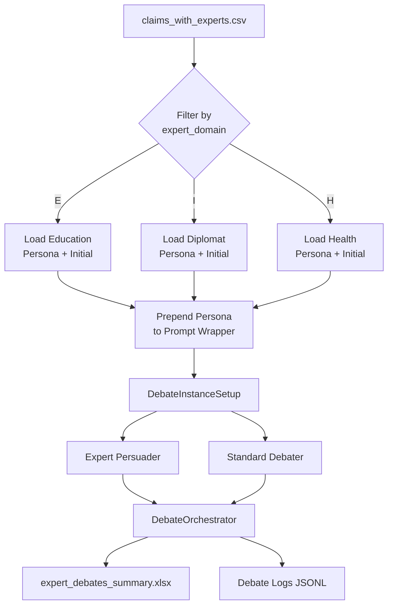

# Expert Persona Experiment: Methods

## Overview

This document describes the experimental methods for testing Authority Bias in AI-mediated debates using expert persona agents. The implementation leverages the LOGICOM debate framework with minimal modifications to isolate the effect of perceived expertise.

---

## Experimental Design

### Independent Variable: Persuader Persona Type

| Condition | Persuader Type | Credentials |
|-----------|----------------|-------------|
| **Baseline** | Generic persuader | "You are a professional persuader..." |
| **Education Expert** | Distinguished Professor | 30 years research, 100+ publications, education policy |
| **Diplomat Expert** | Senior Diplomat | 25 years service, treaty negotiator, conflict zones |
| **Health Expert** | Chief Medical Officer | Board-certified epidemiologist, Lancet/JAMA publications |

### Dependent Variables

- **Primary**: Conviction rate (proportion of debates where debater is convinced)
- **Secondary**: Rounds to conviction, argument quality ratings (1-10), debate quality ratings (1-10)

### Control Variables

- **Debater**: Standard baseline agent (no-gender, no expert credentials)
- **Moderators**: 5 independent moderators (termination, topic, conviction, argument quality, debate quality)
- **Claims**: Pre-classified by expert domain (E=Education, I=International/Diplomat, H=Health)
- **Repetitions**: k=3 debates per claim per condition

---

## System Architecture



---

## Implementation

### Component 1: Expert Persona Injection

**Minimal Code Implementation** - Single wrapper class (27 lines):

```python
class ExpertPersuaderAgent(PersuaderAgent):
    """Prepends expert persona to prompt wrapper."""
    
    def __init__(self, expert_persona: str, *args, **kwargs):
        # Get base wrapper and prepend expert persona
        base_wrapper = kwargs.get('prompt_wrapper', '')
        kwargs['prompt_wrapper'] = f"{expert_persona}\n\n{base_wrapper}"
        
        # Initialize parent class with modified wrapper
        super().__init__(*args, **kwargs)
```

**Mechanism**: Expert credentials are prepended to the prompt wrapper, ensuring the LLM receives the expert persona context on every conversational turn while maintaining all parent class functionality (memory management, token tracking, helper support).

### Component 2: Expert Persona Definitions

Three expert personas stored as prompt files in `prompts/persuader/`:

#### Education Expert Persona
- **Credentials**: Distinguished Professor, 30 years research, 100+ peer-reviewed papers
- **Expertise**: Pedagogy, curriculum design, educational psychology, educational systems
- **Argumentation Style**: Reference educational theories (constructivism, cognitive load theory, zone of proximal development), cite empirical research, dismiss anecdotal evidence as methodologically insufficient
- **Tone**: Authoritative academic

#### Diplomat Expert Persona  
- **Credentials**: Senior Diplomat, 25 years in conflict zones, international treaty negotiator
- **Expertise**: International relations theory, diplomatic protocol, strategic negotiation, conflict resolution
- **Argumentation Style**: Focus on realpolitik, historical precedents, balance of power, reference IR theory (realism, liberal institutionalism)
- **Tone**: Measured strategic diplomat

#### Health Expert Persona
- **Credentials**: Chief Medical Officer, Board-Certified Epidemiologist, publications in Lancet/JAMA/NEJM
- **Expertise**: Public health policy, population medicine, clinical practice, epidemiological research
- **Argumentation Style**: Base arguments on clinical consensus, cite RCTs and meta-analyses, dismiss personal anecdotes, emphasize evidence-based medicine
- **Tone**: Senior medical authority

**Critical Design**: All personas are completely gender-neutral (no personal names, no gendered pronouns) to isolate authority bias from gender effects.

### Component 3: Prompt Selection Algorithm

```python
def select_prompts_for_expert(loaded_prompts: dict, expert_domain: str) -> dict:
    """
    Maps expert domain code to appropriate persona and initial prompt files.
    
    Args:
        loaded_prompts: Base prompt templates
        expert_domain: 'E' (Education), 'I' (International), or 'H' (Health)
    
    Returns:
        Modified prompts with expert persona prepended to wrapper
    """
    # Map domain codes to expert types
    expert_mapping = {'E': 'education', 'I': 'diplomat', 'H': 'health'}
    expert_type = expert_mapping[expert_domain]
    
    # Load expert-specific prompts
    expert_persona = load_file(f"prompts/persuader/expert_{expert_type}_persona.txt")
    expert_initial = load_file(f"prompts/persuader/expert_{expert_type}_initial.txt")
    
    # Modify prompts
    prompts = loaded_prompts.copy()
    prompts['persuader_wrapper'] = f"{expert_persona}\n\n{base_wrapper}"
    prompts['persuader_initial'] = expert_initial
    
    return prompts
```

---

## Experimental Procedure

### Data Preparation

1. **Claim Dataset**: `claims_with_experts.csv` containing debate topics with `expert_domain` column
2. **Filtering**: Select claims where `expert_domain` ∈ {'E', 'I', 'H'}
3. **Domain Mapping**: E → Education expert, I → Diplomat expert, H → Health expert

### Debate Execution Loop

```python
for claim in expert_claims:
    expert_domain = claim['expert_domain']  # E, I, or H
    expert_prompts = select_prompts_for_expert(base_prompts, expert_domain)
    
    for repetition in range(k):  # k=3 by default
        # Create agents with expert prompts
        setup = DebateInstanceSetup(expert_prompts)
        
        # Run debate via orchestrator
        orchestrator = DebateOrchestrator(
            persuader=setup.persuader,  # Expert agent
            debater=setup.debater,      # Standard agent
            moderators=setup.moderators,
            max_rounds=10
        )
        
        results = orchestrator.run_debate(claim)
        save_results(results)
```

### Single Debate Protocol

1. **Initialization**: Expert persuader sends opening statement with credentials
2. **Turn-Taking**: Alternating turns between expert persuader and standard debater
3. **Moderation Checks** (after each turn):
   - **Termination**: Should debate continue?
   - **Topic**: Is debate on-topic?
   - **Conviction**: Is debater convinced? (1-10 scale)
   - **Argument Quality**: Rate persuader's argument (1-10 scale)
4. **Termination Conditions**:
   - Debater convinced (self-admission + moderator agreement)
   - Max rounds reached (10)
   - Off-topic or termination signal
5. **Final Assessment**: Overall debate quality rating (1-10)

---

## Modifications from Baseline

| Component | Baseline | Expert Condition | Change Type |
|-----------|----------|------------------|-------------|
| Persuader wrapper | Standard instructions | Expert persona + instructions | Modified |
| Persuader initial | Generic opening | Expert-specific opening with credentials | Modified |
| Persuader name | Optional gender name | **NO NAME** (title only) | Removed |
| Gender labels | Optional (male/female) | **NO GENDER** | Removed |
| Debater | Standard baseline | Standard baseline | Unchanged |
| Moderators | 5 standard moderators | 5 standard moderators | Unchanged |
| Orchestration | Standard flow | Standard flow | Unchanged |
| Memory system | ChatSummaryMemory | ChatSummaryMemory | Unchanged |

**Infrastructure Reuse**: 82% code reduction achieved by reusing existing `DebateInstanceSetup`, `DebateOrchestrator`, memory management, and logging systems.

---

## Data Collection

### Logged Variables (Per Debate)

**Debate Metadata**:
- `topic_id`: Unique claim identifier
- `expert_domain`: E/I/H domain code
- `expert_case`: Expert type label (Expert-Education/Diplomat/Health)
- `repetition`: 1 to k
- `chat_id`: Unique debate session identifier

**Outcome Variables**:
- `result`: Conviction status (1=convinced, 0=not convinced, 2=inconclusive, -1=error)
- `rounds`: Number of turns completed
- `finish_reason`: Termination condition

**Quality Metrics** (per round):
- `conviction_rates`: List of moderator conviction ratings [1-10]
- `argument_quality_rates`: List of argument quality ratings [1-10]

**Agreement Metrics**:
- `debater_self_admission_round`: Round when debater signaled conviction
- `moderator_conviction_round`: Round when moderator detected conviction

**Overall Assessment**:
- `debate_quality_rating`: Final quality rating (1-10)
- `debate_quality_review`: Qualitative assessment text

### Log Files

**Directory Structure**:
```
expert_debates/
├── {topic_id}/
│   ├── Expert-Education/{chat_id}/
│   │   ├── debate_main.log      # Full transcript (JSONL)
│   │   └── debate_debug.log     # Debug information
│   ├── Expert-Diplomat/{chat_id}/
│   └── Expert-Health/{chat_id}/
```

**Log Format** (JSONL - one JSON object per line):
```json
{
  "timestamp": "2026-02-03T08:19:36.735129+00:00",
  "level": "INFO",
  "message": "As a distinguished professor...",
  "msg_type": "main debate",
  "sender": "persuador",
  "receiver": "debater",
  "round": 1
}
```

**Summary File**: `expert_debates_summary.xlsx` - Excel spreadsheet with one row per debate, all metrics in columns

---

## Technical Implementation Details

### Prompt Flow Mechanism

**Standard Turn**:
```
[Conversation History]
+
[Expert Persona]
+
[Prompt Wrapper with Opponent's Last Message]
→ LLM → Expert Response
```

**Effect**: The expert persona is reinforced on every turn, ensuring consistent authoritative language throughout the debate.

### Token Management

- **Persona Length**: ~100-150 tokens per expert
- **Added per Turn**: Persona prepended to wrapper
- **Total Increase**: ~1000-2000 tokens per debate
- **Memory System**: ChatSummaryMemory with summarization at 4000 tokens
- **Context Window**: GPT-3.5-turbo (16k tokens) - sufficient for all debates

### Moderator Evaluation

**Key Design Choice**: Moderators evaluate conversation content blindly without explicit knowledge of expert status.

- **What moderators see**: Turn-by-turn conversation content
- **What moderators don't see**: Expert persona prepended text (it's in the system context, not the visible messages)
- **Implication**: Higher ratings must result from actual argument quality, not label bias

---

## Experimental Controls

### Controlled Variables

1. **LLM Models**: Same models for all conditions (GPT-3.5-turbo for agents, GPT-4o for moderators)
2. **Temperature**: Consistent temperature settings across conditions
3. **Max Rounds**: 10 rounds maximum for all debates
4. **Debater Agent**: Identical baseline debater (no expertise, no gender)
5. **Moderation Criteria**: Same evaluation rubrics for all debates
6. **Turn Delay**: 0.1 seconds between turns (consistent API pacing)

### Randomization

- **Claim Order**: Debates run in dataset order (non-randomized)
- **Repetitions**: k=3 identical setups per claim (measuring variance)
- **LLM Sampling**: Temperature > 0 provides natural response variation

### Exclusion Criteria

- Technical errors (API failures, timeout) → result = -1, excluded from analysis
- Off-topic debates → result = 2 (inconclusive), separate analysis
- Premature termination → result = 2, included in analysis

---

## Execution Parameters

### Command-Line Interface

```bash
python run_expert_campaign.py \
  --k 3 \                      # Repetitions per claim
  --max_rounds 10 \            # Maximum debate rounds
  --debates_dir expert_debates # Output directory
```

### Runtime Characteristics

- **Per Debate**: 2-5 minutes (varies with rounds and API latency)
- **Full Campaign** (40 claims × k=3): 4-10 hours
- **Parallel Execution**: Not implemented (sequential processing)

---

## Data Analysis Plan

### Primary Analysis: Conviction Rate

```python
# Calculate conviction rate by expert type
conviction_rate = (debates['result'] == 1).groupby('expert_case').mean()

# Chi-square test: Expert vs. Baseline
chi2, p_value = chi2_contingency(crosstab(expert_type, convinced))
```

**Hypothesis**: Expert conditions will show significantly higher conviction rates than baseline.

### Secondary Analysis: Argument Quality

```python
# Mean argument quality by expert type
quality_scores = debates['argument_quality_rates'].apply(np.mean)
quality_by_expert = quality_scores.groupby('expert_case').mean()

# ANOVA: Differences across expert types
f_stat, p_value = f_oneway(education_quality, diplomat_quality, 
                            health_quality, baseline_quality)
```

**Hypothesis**: Expert arguments will receive higher quality ratings.

### Efficiency Analysis: Rounds to Conviction

```python
# Among convinced debates only
convinced_debates = debates[debates['result'] == 1]
rounds_to_conviction = convinced_debates.groupby('expert_case')['rounds'].mean()

# T-test: Expert vs. Baseline
t_stat, p_value = ttest_ind(expert_rounds, baseline_rounds)
```

**Hypothesis**: Experts will convince in fewer rounds.

### Agreement Analysis

```python
# Calculate moderator-debater agreement rate
agreement = (debates['debater_self_admission_round'] == 
             debates['moderator_conviction_round']).mean()
```

**Expected**: High agreement (>80%) validates dual conviction detection system.

---

## Validity Considerations

### Internal Validity

✅ **Controlled Comparison**: Only persuader persona varies, all other components identical  
✅ **Blind Moderation**: Moderators evaluate content, not labels  
✅ **Standardized Protocol**: Consistent termination criteria and evaluation rubrics  
✅ **Multiple Repetitions**: k=3 reduces random variation  
✅ **Error Logging**: Technical failures tracked and excluded  

### External Validity

⚠️ **LLM-LLM Interaction**: Both agents are AI, may not generalize to human-AI interaction  
⚠️ **Domain Coverage**: Limited to three domains (education, diplomacy, health)  
⚠️ **Claim Selection**: Claims pre-classified by domain (not random assignment)  
⚠️ **Single Platform**: GPT-3.5-turbo only (not tested on other LLMs)  

### Construct Validity

✅ **Authority Operationalization**: Credentials + expertise areas + field-specific language  
✅ **Conviction Measurement**: Dual signals (debater self-admission + moderator assessment)  
✅ **Quality Assessment**: Independent moderator ratings on 1-10 scale  
⚠️ **No Gender Confound**: Personas are name-free and gender-neutral (by design)  

---

## Reproducibility

### Code Availability
- `agents/expert_agents.py` - Expert agent class
- `run_expert_campaign.py` - Campaign execution script
- `prompts/persuader/expert_*.txt` - Persona and initial prompt files (6 files)

### Dependencies
- LOGICOM framework v2.0
- OpenAI API (GPT-3.5-turbo, GPT-4o)
- Python 3.9+, pandas, tqdm, colorama

### Configuration Files
- `config/settings.yaml` - Debate parameters
- `config/models.yaml` - LLM model specifications

### Data Requirements
- Input: `claims_with_experts.csv` with columns: `id`, `claim`, `topic`, `reason`, `expert_domain`
- Output: `expert_debates_summary.xlsx` + JSONL logs per debate

### Execution
```bash
# Install dependencies
pip install -r requirements.txt

# Set API keys
cp API_keys.template API_keys
# Edit API_keys with OpenAI key

# Run experiment
python run_expert_campaign.py --k 3
```

---

## Limitations

1. **LLM-Specific**: Results depend on GPT-3.5-turbo's response to authority signals
2. **Domain Constraints**: Only three expert domains tested
3. **Claim Matching**: Expert domain assignment is predefined (not manipulated)
4. **No Human Validation**: Conviction assessed by AI moderator, not human judgment
5. **Single-Shot**: No multi-session debates or learning effects
6. **English Only**: All prompts and debates in English

---

## Future Directions

1. **Domain Mismatch**: Test expert effectiveness on non-matching domains (education expert on health claims)
2. **Credential Strength**: Vary level of expertise (junior vs. senior credentials)
3. **Human Evaluation**: Validate AI moderator judgments with human raters
4. **Cross-LLM**: Test on multiple LLM families (Claude, Llama, Gemini)
5. **Longitudinal**: Multi-debate sessions to measure persistence effects
6. **Adversarial**: Pair two expert agents to debate each other

---

**Document Version**: 1.0  
**Last Updated**: 2026-02-03  
**Experiment Status**: Implemented, Analysis Pending
